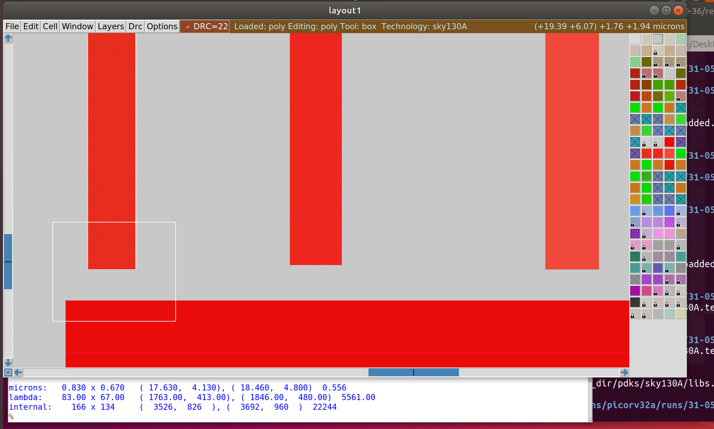

# Sky130 PD Workshop - Advanced Physical Design using OpenLANE/SKY130

## Overview
OpenLANE is an opensource tool or flow used for opensource tape-outs. The OpenLANE flow comprises a variety of tools such as Yosys, ABC, OpenSTA, Fault, OpenROAD app, Netgen and Magic which are used to harden chips and macros, i.e. generate final GDSII from the design RTL. The primary goal of OpenLANE is to produce clean GDSII with no human intervention. OpenLANE has been tuned to function for the Google-Skywater130 Opensource Process Design Kit.

## Inception of Opensource EDA

### How to talk to computers?

The RISC-V Instruction Set Architecture (ISA) is a language used to talk to computers whose hardware is based on RISC-V core. If a user wishes to run a certain application software on a computer, its corresponding C/C++/Java program must be converted into instructions by the compliler. The ouput of the compiler is hardware dependent. These instructions go as inputs to the assembler which outputs binary language that the hardware logic in the chip layout can make sense of. According to the bits received, the digital logic consisting of gates performs the function required by the user of the application software.

From conception to product, the ASIC design flow is an iterative process that is not static for every design. The details of the flow may change depending on ECO’s, IP requirements, DFT insertion, and SDC constraints, however the base concepts still remain. The flow can be broken down into 11 steps:

1. Architectural Design – A system engineer will provide the VLSI engineer with specifications for the system that are determined through physical constraints. 
   The VLSI engineer will be required to design a circuit that meets these constraints at a microarchitecture modeling level.

2. RTL Design/Behavioral Modeling – RTL design and behavioral modeling are performed with a hardware description language (HDL). 
   EDA tools will use the HDL to perform mapping of higher-level components to the transistor level needed for physical implementation. 
   HDL modeling is normally performed using either Verilog or VHDL. One of two design methods may be employed while creating the HDL of a microarchitecture:
   
    a. RTL Design – Stands for Register Transfer Level. It provides an abstraction of the digital   circuit using:
   
   - i. 	 Combinational logic
   - ii. 	 Registers
   - iii.  Modules (IP’s or Soft Macros)
 
    b. 	Behavioral Modeling – Allows the microarchitecture modeling to be performed with behavior-based modeling in HDL. This method bridges the gap between C and HDL allowing HDL design to be performed

3. RTL Verification - Behavioral verification of design

4. DFT Insertion - Design-for-Test Circuit Insertion

5. Logic Synthesis – Logic synthesis uses the RTL netlist to perform HDL technology mapping. The synthesis process is normally performed in two major steps:

     - GTECH Mapping – Consists of mapping the HDL netlist to generic gates what are used to perform logical optimization based on AIGERs and other topologies created 
       from the generic mapped netlist.
       
     - Technology Mapping – Consists of mapping the post-optimized GTECH netlist to standard cells described in the PDK
  
6. Standard Cells – Standard cells are fixed height and a multiple of unit size width. This width is an integer multiple of the SITE size or the PR boundary. Each standard cell comes with SPICE, HDL, liberty, layout (detailed and abstract) files used by different tools at different stages in the RTL2GDS flow.

7. Post-Synthesis STA Analysis: Performs setup analysis on different path groups.

8. Floorplanning – Goal is to plan the silicon area and create a robust power distribution network (PDN) to power each of the individual components of the synthesized netlist. In addition, macro placement and blockages must be defined before placement occurs to ensure a legalized GDS file. In power planning we create the ring which is connected to the pads which brings power around the edges of the chip. We also include power straps to bring power to the middle of the chip using higher metal layers which reduces IR drop and electro-migration problem.

9. Placement – Place the standard cells on the floorplane rows, aligned with sites defined in the technology lef file. Placement is done in two steps: Global and Detailed. In Global placement tries to find optimal position for all cells but they may be overlapping and not aligned to rows, detailed placement takes the global placement and legalizes all of the placements trying to adhere to what the global placement wants.

10. CTS – Clock tree synteshsis is used to create the clock distribution network that is used to deliver the clock to all sequential elements. The main goal is to create a network with minimal skew across the chip. H-trees are a common network topology that is used to achieve this goal.

11. Routing – Implements the interconnect system between standard cells using the remaining available metal layers after CTS and PDN generation. The routing is performed on routing grids to ensure minimal DRC errors.

The Skywater 130nm PDK uses 6 metal layers to perform CTS, PDN generation, and interconnect routing.

### Opensource EDA tools

OpenLANE utilises a variety of opensource tools in the execution of the ASIC flow:
Task | Tool/s
------------ | -------------
RTL Synthesis & Technology Mapping | [yosys](https://github.com/YosysHQ/yosys), abc
Floorplan & PDN | init_fp, ioPlacer, pdn and tapcell
Placement | RePLace, Resizer, OpenPhySyn & OpenDP
Static Timing Analysis | [OpenSTA](https://github.com/The-OpenROAD-Project/OpenSTA)
Clock Tree Synthesis | [TritonCTS](https://github.com/The-OpenROAD-Project/OpenLane)
Routing | FastRoute and [TritonRoute](https://github.com/The-OpenROAD-Project/TritonRoute) 
SPEF Extraction | [SPEF-Extractor](https://github.com/HanyMoussa/SPEF_EXTRACTOR)
DRC Checks, GDSII Streaming out | [Magic](https://github.com/RTimothyEdwards/magic), [Klayout](https://github.com/KLayout/klayout)
LVS check | [Netgen](https://github.com/RTimothyEdwards/netgen)
Circuit validity checker | [CVC](https://github.com/d-m-bailey/cvc)

#### OpenLANE design stages

1. Synthesis
	- `yosys` - Performs RTL synthesis
	- `abc` - Performs technology mapping
	- `OpenSTA` - Performs static timing analysis on the resulting netlist to generate timing reports
2. Floorplan and PDN
	- `init_fp` - Defines the core area for the macro as well as the rows (used for placement) and the tracks (used for routing)
	- `ioplacer` - Places the macro input and output ports
	- `pdn` - Generates the power distribution network
	- `tapcell` - Inserts welltap and decap cells in the floorplan
3. Placement
	- `RePLace` - Performs global placement
	- `Resizer` - Performs optional optimizations on the design
	- `OpenDP` - Perfroms detailed placement to legalize the globally placed components
4. CTS
	- `TritonCTS` - Synthesizes the clock distribution network (the clock tree)
5. Routing
	- `FastRoute` - Performs global routing to generate a guide file for the detailed router
	- `CU-GR` - Another option for performing global routing.
	- `TritonRoute` - Performs detailed routing
	- `SPEF-Extractor` - Performs SPEF extraction
6. GDSII Generation
	- `Magic` - Streams out the final GDSII layout file from the routed def
	- `Klayout` - Streams out the final GDSII layout file from the routed def as a back-up
7. Checks
	- `Magic` - Performs DRC Checks & Antenna Checks
	- `Klayout` - Performs DRC Checks
	- `Netgen` - Performs LVS Checks
	- `CVC` - Performs Circuit Validity Checks

#### OpenLANE Files

The openLANE file structure looks something like this:

- skywater-pdk: contains PDK files provided by foundry
- open_pdks: contains scripts to setup pdks for opensource tools 
- sky130A: contains sky130 pdk files

#### Invoking OpenLANE and Design Preparation 

Openlane can be invoked using docker command followed by opening an interactive session.
flow.tcl is a script that specifies details for openLANE flow.

```
docker
./flow.tcl -interactive
package require openlane 0.9
```

```
prep -design picorv32a
```


#### Review of files & Synthesis step
* A "runs" folder is generated within the picorv32a folder.
* The merged file is created during the merging operation in the pircorv32a design preparation (it merges lef and techlef files)
* Next, we run the synthesis of picorv32a design in the openlane interactive terminal:

`run_synthesis`


* The yosys and ABC tools are utilised to convert RTL to gate level netlist.
* Calcuation of Flop Ratio:
```
Flop ratio = Number of D Flip flops / Total Number of cells
```

```
dfxtp_4 = 1613,
Number of cells = 14876,
Flop ratio = 1613/14876 = 0.1084 = 10.84%
```

## Floorplanning & Placement and library cells

### Floorplanning considerations

#### Utilization Factor & Aspect Ratio  

Two parameters are of importance when it comes to floorplanning namely, Utilisation Factor and Aspect Ratio. They are defined as follows:

```
Utilisation Factor =  Area occupied by netlist / Total area of core
```

```
Aspect Ratio =  Height / Width
```
A Utilisation Factor of 1 signifies 100% utilisation leaving no space for extra cells such as buffer. However, practically, the Utilisation Factor is 0.5-0.6. Likewise, an Aspect ratio of 1 implies that the chip is square shaped. Any value other than 1 implies rectanglular chip.

#### Pre-placed cells

Once the Utilisation Factor and Aspect Ratio has been decided, the locations of pre-placed cells need to be defined. Pre-placed cells are IPs comprising large combinational logic which once placed maintain a fixed position. Since they are placed before placement and routing, the are known as pre-placed cells.

#### Decoupling capacitors

Pre-placed cells must then be surrounded with decoupling capacitors (decaps). The resistances and capacitances associated with long wire lengths can cause the power supply voltage to drop significantly before reaching the logic circuits. This can lead to the signal value entering into the undefined region, outside the noise margin range. Decaps are huge capacitors charged to power supply voltage and placed close the logic circuit. Their role is to decouple the circuit from power supply by supplying the necessary amount of current to the circuit. They pervent crosstalk and enable local communication.

#### Power Planning

Each block on the chip, however, cannot have its own decap unlike the pre-placed macros. Therefore, a good power planning ensures that each block has its own VDD and VSS pads connected to the horizontal and vertical power and GND lines which form a power mesh.

#### Pin Placement

The netlist defines connectivity between logic gates. The place between the core and die is utilised for placing pins. The connectivity information coded in either VHDL or Verilog is used to determine the position of I/O pads of various pins. Then, logical placement blocking of pre-placed macros is performed so as to differentiate that area from that of the pin area.

#### Floorplan run on OpenLANE & view in Magic

* Importance files in increasing priority order:

1. ```floorplan.tcl``` - System default envrionment variables
2. ```conifg.tcl```
3. ```sky130A_sky130_fd_sc_hd_config.tcl```

* Floorplan envrionment variables or switches:

1. ```FP_CORE_UTIL``` - floorplan core utilisation
2. ```FP_ASPECT_RATIO``` - floorplan aspect ratio
3. ```FP_CORE_MARGIN``` - Core to die margin area
4. ```FP_IO_MODE``` - defines pin configurations (1 = equidistant/0 = not equidistant)
5. ```FP_CORE_VMETAL``` - vertical metal layer
6. ```FP_CORE_HMETAL``` - horizontal metal layer

***Note: Usually, vertical metal layer and horizontal metal layer values will be 1 more than that specified in the files***
 
 To run the picorv32a floorplan in openLANE:
 ```
 run_floorplan
 
 ```


Post the floorplan run, a .def file will have been created within the ```results/floorplan``` directory. 
We may review floorplan files by checking the ```floorplan.tcl```. 
The system defaults will have been overriden by switches set in ```conifg.tcl``` and further overriden by switches set in ```sky130A_sky130_fd_sc_hd_config.tcl```.
 
To view the floorplan, Magic is invoked after moving to the ```results/floorplan``` directory:

```
magic -T ~/Desktop/work/tools/openlane_working_dir/pdks/sky130A/libs.tech/magic/sky130A.tech lef read ../../tmp/merged.lef def read picorv32a.floorplan.def &
```
* One can zoom into Magic layout by selecting an area with left and right mouse click followed by pressing `"z"` key (zoom out via `"SHIFT + z"`). 
* Various components can be identified by using the ```what``` command in tkcon window after making a selection on the component.
* Zooming in also provides a view of decaps present in picorv32a chip.
* The standard cell can be found at the bottom left corner.


### Placement 

#### Placement Optimization

The next step in the OpenLANE ASIC flow is placement. The synthesized netlist is to be placed on the floorplan. Placement is perfomed in 2 stages:

1. Global Placement: It finds optimal position for all cells which may not be legal and cells may overlap. Optimization is done through reduction of half parameter wire length.
2. Detailed Placement: It alters the position of cells post global placement so as to legalise them.

Legalisation of cells is important from timing point of view. 

#### Placement run on OpenLANE & view in Magic

Command:

```
run_placement
```


The objective of placement is the convergence of overflow value. If overflow value progressively reduces during the placement run it implies that the design will converge and placement will be successful. Post placement, the design can be viewed on magic within ```results/placement``` directory:

```
magic -T ~/Desktop/work/tools/openlane_working_dir/pdks/sky130A/libs.tech/magic/sky130A.tech lef read ../../tmp/merged.lef def read picorv32a.placement.def &

```


### Standard Cell Design Flow

Standard cell design flow involves the following:

1. Inputs: PDKs, DRC & LVS rules, SPICE models, libraries, user-defined specifications. 
2. Design steps: Circuit design, Layout design (Art of layout Euler's path and stick diagram), Extraction of parasitics, Characterization (timing, noise, power).
3. Outputs: CDL (circuit description language), LEF, GDSII, extracted SPICE netlist (.cir), timing, noise and power .lib files

### Standard Cell Characterization Flow

A typical standard cell characterization flow includes the following steps:

1. Read in the models and tech files
2. Read extracted spice netlist
3. Recognise behaviour of the cell
4. Read the subcircuits
5. Attach power sources
6. Apply stimulus to characterization setup
7. Provide necessary output capacitance loads
8. Provide necessary simulation commands

The opensource software called GUNA can be used for characterization. Steps 1-8 are fed into the GUNA software which generates timing, noise and power models.

### Timing Parameter Definitions

Timing defintion | Value
------------ | -------------
slew_low_rise_thr  | 20% value
slew_high_rise_thr |  80% value
slew_low_fall_thr | 20% value
slew_high_fall_thr | 80% value
in_rise_thr | 50% value
in_fall_thr | 50% value
out_rise_thr | 50% value
out_fall_thr | 50% value

```
rise delay =  time(out_fall_thr) - time(in_rise_thr)

Fall transition time: time(slew_high_fall_thr) - time(slew_low_fall_thr)

Rise transition time: time(slew_high_rise_thr) - time(slew_low_rise_thr)
```

A poor choice of threshold points leads to neative delay value. Therefore a correct choice of thresholds is very important.

## Design library cell

OpenLANE allows users to make changes to environment variables on the fly. For instance, if we wish to change the pin placement from equidistant to some other style of placement we may do the following in the openLANE flow:

```
set ::env(FP_IO_MODE) 2
```


### SPICE Deck creation & Simulation

A SPICE deck includes information about the following:

1. Model description
2. Netlist description
3. Component connectivity
4. Component values
5. Capacitance load
6. Nodes
7. Simulation type and parameters
8. Libraries included

### CMOS inverter Switching Threshold Vm

Thw sitching threshold of a CMOS inverter is the point on the transfer characteristic where Vin equals Vout (=Vm). At this point both PMOS and NMOS are in ON state which gives rise to a leakage current

### 16 Mask CMOS Fabrication

The 16-mask CMOS process consists of the following steps:

1. Selection of subtrate: Secting the body/substrate material.
2. Creating active region for transistors: Isolation between active region pockets by SiO2 and Si3N4 deposition followed by photolithography and etching.
3. N-well and P-well formation: Ion implanation by Boron for P-well and by Phosphorous for N-well formation.
4. Formation of gate terminal: NMOS and PMOS gates formed by photolithography techniques.
5. LDD (lightly doped drain) formation: LDD formed to prevent hot electron effect.
6. Source & drain formation: Screen oxide added to avoid channelling during implants followed by Aresenic implantation and annealing.
7. Local interconnect formation: Removal of screen oxide by HF etching. Deposition of Ti for low resistant contacts.
8. Higher level metal formation: CMP for planarization followed by TiN and Tungsten deposition. Top SiN layer for chip protection.

### Inverter Standard cell Layout & SPICE extraction

The Magic layout of a CMOS inverter will be used so as to intergate the inverter with the picorv32a design. To do this, inverter magic file is sourced from [vsdstdcelldesign](https://github.com/nickson-jose/vsdstdcelldesign) by cloning it within the ```openlane_working_dir/openlane``` directory as follows:

```
git clone https://github.com/nickson-jose/vsdstdcelldesign
```

This creates a vsdstdcelldesign named folder in the openlane directory.

To invoke magic to view the ```sky130_inv.mag``` file, the sky130A.tech file must be included in the command along with its path. To ease up the complexity of this command, the tech file can be copied from the magic folder to the vsdstdcelldesign folder.

The sky130_inv.mag file can then be invoked in Magic very easily:

```
magic -T sky130A.tech sky130_inv.mag &
```


In Sky130 the first layer is called the local interconnect layer or Locali.

To verify whether the layout is that of CMOS inverter, verification of P-diffusiona nd N-diffusion regions with Polysilicon can be observed.

Other verification steps are to check drain and source connections. The drains of both PMOS and NMOS must be connected to output port (here, Y) and the sources of both must be connected to power supply VDD (here, VPWR).

**LEF or library exchange format:**
A format that tells us about cell boundaries, VDD and GND lines. It contains no info about the logic of circuit and is also used to protect the IP.

**SPICE extraction:**
Within the Magic environment, following commands are used in tkcon to achieve .mag to .spice extraction:

```
extract all
ext2spice cthresh 0 rethresh 0
ext2spice
```


This generates the ```sky130_in.spice``` file.
For simulation, ngspice is invoked in the terminal:

```
ngspice sky130_inv.spice
```


The output "y" is to be plotted with "time" and swept over the input "a":

```
plot y vs time a
```


### Inverter Standard cell characterization

Four timing parameters are used to characterize the inverter standard cell:

1. Rise transition: Time taken for the output to rise from 20% of max value to 80% of max value
2. Fall transition- Time taken for the output to fall from 80% of max value to 20% of max value
3. Cell rise delay = time(50% output rise) - time(50% input fall)
4. Cell fall delay  = time(50% output fall) - time(50% input rise)

The above timing parameters can be computed by noting down various values from the ngspice waveform.

```Rise transition = (2.23843 - 2.17935) = 59.08ps```

```Fall transition = (4.09291 - 4.05004) = 42.87ps```

```Cell rise delay = (2.20636 - 2.15) = 56.36ps```

```Cell fall delay = (4.07479 - 4.05) = 24.79ps```





